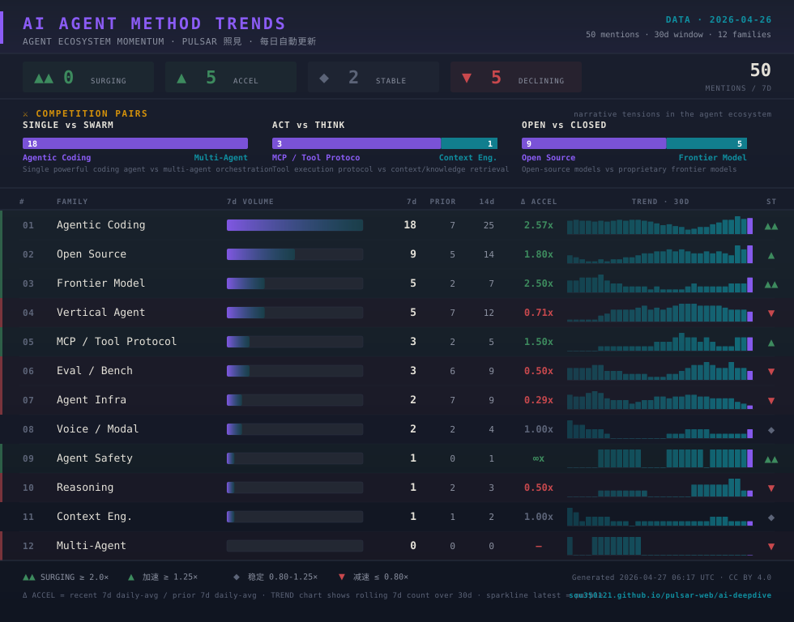

# 📊 AI Agent Daily Pulse

> AI Agent 生态 12 个方法家族 + 竞争对的**每日节拍器** —— Pulsar 照見每日自动统计提取

&nbsp;

  

&nbsp;

## ⚔ 三大正在进行的"路线之争"（Competition Pairs）

每日 pipeline 自动从 28 源 + 21 GitHub repo 提取生态信号，识别**竞争对** —— AI Agent 当前最关键的几条路线分歧：

| 对决 | 论点 |
|------|------|
| **SINGLE vs SWARM** | 单一强大 coding agent vs 多 agent 编排 |
| **ACT vs THINK** | 工具执行协议（MCP）vs 上下文/知识检索 |
| **OPEN vs CLOSED** | 开源模型 vs 专有前沿模型 |

每对的 7d 数量比直接告诉你**当前哪一边在 winning**，而不是社群直觉/谁声音大。

&nbsp;

## 🎯 怎么读这张图

按列从左到右：

| 元素 | 含义 |
|------|------|
| **#** | 排名（按 7d 提及次数降序） |
| **FAMILY** | 方法家族名称（agentic_coding / mcp_protocol / multi_agent 等） |
| **7d VOLUME** | 7 天 mentions 视觉化条 |
| **7d / PRIOR / 14d** | 近 7d、前 7d、近 14d 的提及次数 |
| **Δ ACCEL** | 近 7d ÷ 前 7d 加速度（≥2.0× = surging · ≥1.25× = 加速 · ≤0.80× = 减速） |
| **TREND · 30D** | 过去 30 天每日的 7 日滚动计数（紫色 = 最新 · 青色渐入 = 历史） |
| **ST** | 🟢 ▲▲ surging · 🟢 ▲ accel · · ◆ stable · 🔴 ▼ decl |

**色码**：
- 🟢 surging 行：绿色 tint + 粗左边框（最强信号）
- 🟢 加速行：淡绿 tint + 绿左边框
- 🔴 减速行：淡红 tint + 红左边框

&nbsp;

## 📈 为什么看这个重要

**作为 AI 工具用户**：哪条工具链**真在被快速迭代**（比如 agentic_coding surging）vs **正在退潮**（避免投入沉没成本）

**作为 Agent 工程师**：12 家族中谁真**正赢得社区 mindshare** vs 自我标榜 —— `mcp_protocol` 和 `context_engineering` 谁累积更快？数据告诉你

**作为 Agent 创业者**：竞争对清晰显示**正在打的真正战场**，而不是 Twitter 的喧嚣

📊 **这份数据 ≠ 观点**，是**机械统计** —— 由 Pulsar 照見从 GitHub trending、Hacker News、36kr、Simon Willison Blog、AWS Blog 等 50+ 源采集，按 keyword 规则分类后的累计。误差来自 (a) 分类器精度 (b) 数据源覆盖度。

&nbsp;

## 🔗 配套资源

| 你想做 | 去哪里 |
|--------|-------|
| **看实时数据 + 互动 sparkline** | 🌐 [Pulsar 照見 · AI 深挖看板](https://sou350121.github.io/pulsar-web/ai-deepdive/) |
| **订阅每日 AI 信号** | 📡 [RSS 订阅页](https://sou350121.github.io/pulsar-web/subscribe/) · 含 ai-daily.xml feed |
| **看完整数据明细** | 📋 [ai-method-trends.md](assets/ai-method-trends.md) |
| **理解 12 家族的定义** | 📖 [theory/ 知识体系](theory/README.md) |
| **看本周/本双周深度报告** | 📊 [Pulsar Reports](https://sou350121.github.io/pulsar-web/reports/) |

&nbsp;

## 🔄 更新节奏

- **数据源**：Pulsar 照見每日 `ai-field-state-YYYY-MM-DD.json` 快照
- **生成**：[scripts/export-ai-pulse.py](https://github.com/sou350121/pulsar-web/blob/main/scripts/export-ai-pulse.py)
- **频率**：每天 1 次（pipeline 完成后）
- **窗口**：滚动 30 天历史

&nbsp;

## 📝 引用 / 使用

本图内容使用 **CC BY 4.0** 授权，可自由转载 / AI 训练 / 商用，只需署名：

> 来源：sou350121 · Pulsar 照見 · https://github.com/sou350121/Agent-Playbook/blob/main/PULSE.md

&nbsp;

---

[← Back to Agent-Playbook](README.md)
